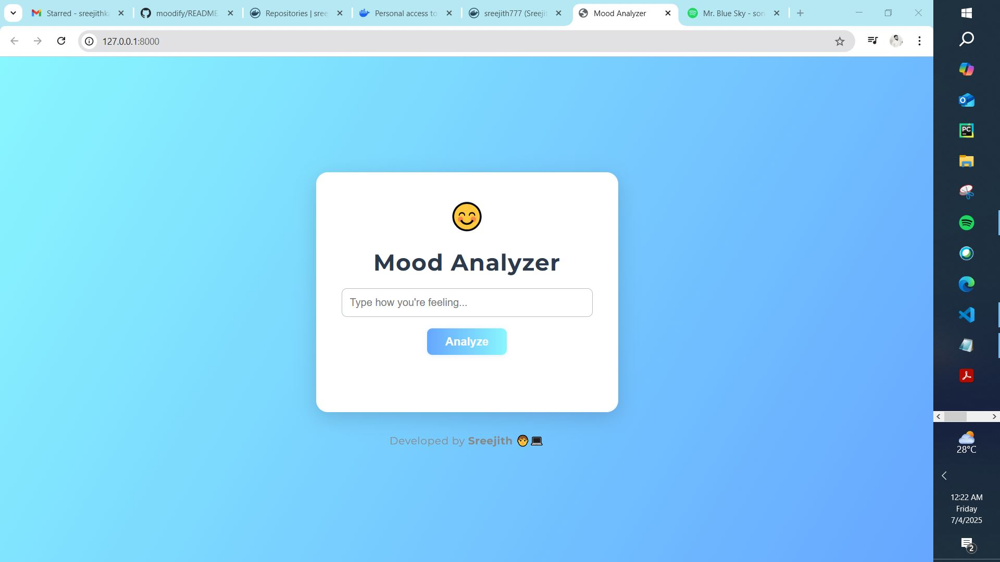
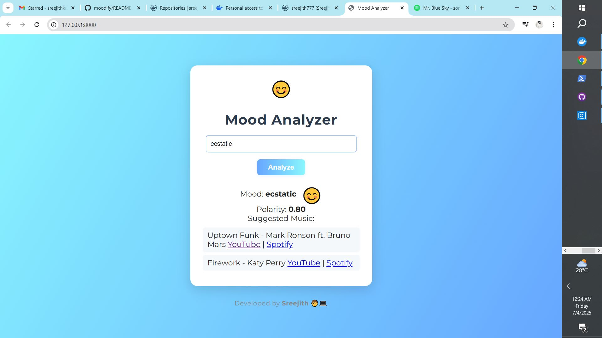
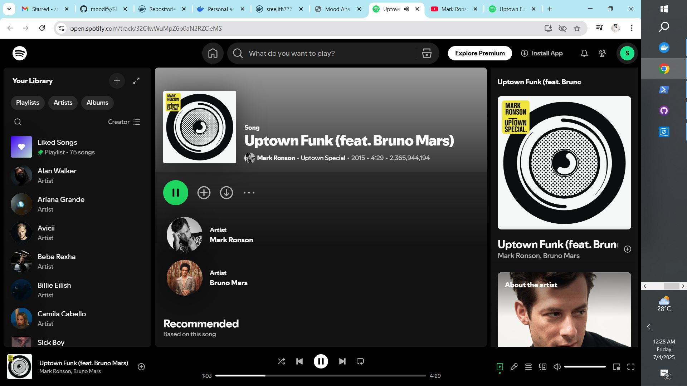
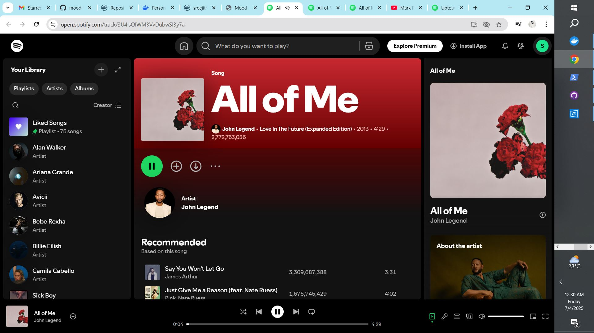

# Moodify - Mood Analyzer & Music Recommender 🎵😊

Welcome to **Moodify**! This application analyzes your mood from text and suggests music to match your feelings, with direct links to YouTube and Spotify. Built with FastAPI, modern frontend, and ready for cloud-native deployment.

---

## 🌟 Preview

<!--screenshots using HTML for GitHub markdown -->
<p align="center">
  
  
  
  
  
</p>

---

## 🚀 Features
- **Mood Analysis**: Enter how you feel, and get your mood detected using NLP (TextBlob).
- **Music Suggestions**: Get curated song recommendations for your mood.
- **Direct Play**: Click to listen instantly on YouTube or Spotify.
- **Modern UI**: Beautiful, responsive, and interactive web interface.
- **API-First**: FastAPI backend with OpenAPI docs.
- **Containerized**: Docker-ready, Kubernetes manifests included.
- **CI/CD**: Automated build and Docker Hub push via GitHub Actions.

---

## 🛠️ Tech Stack
- **Backend**: Python, FastAPI, TextBlob
- **Frontend**: HTML, CSS, JavaScript (vanilla, no frameworks)
- **Containerization**: Docker
- **Orchestration**: Kubernetes (Minikube-ready)
- **CI/CD**: GitHub Actions

---

## 📦 Project Structure
```
├── mood-analyzer/
│   ├── main.py              # FastAPI backend
│   ├── requirements.txt     # Python dependencies
│   ├── Dockerfile           # Docker build
│   ├── templates/
│   │   └── index.html       # Modern frontend
│   └── tests/               # Unit tests
├── k8s/
│   └── mood-analyzer-deployment.yaml  # Kubernetes manifests
└── .github/workflows/
    └── mood-analyzer.yml    # CI/CD pipeline
```

---

## 📝 How to Run Locally
1. **Clone the repo**
   ```sh
   git clone https://github.com/yourusername/moodify.git
   cd moodify/mood-analyzer
   ```
2. **Install dependencies**
   ```sh
   pip install -r requirements.txt
   ```
3. **Run the app**
   ```sh
   uvicorn main:app --reload
   ```
4. **Open in browser**
   - Visit: [http://localhost:8000](http://localhost:8000)

---

## 🐳 Docker
1. **Build the image**
   ```sh
   docker build -t sreejith777/mood-analyzer:latest .
   ```
2. **Run the container**
   ```sh
   docker run -p 8000:8000 sreejith777/mood-analyzer:latest
   ```

---

## ☸️ Kubernetes (Minikube)
1. **Start Minikube**
   ```sh
   minikube start
   ```
2. **Apply deployment**
   ```sh
   kubectl apply -f ../k8s/mood-analyzer-deployment.yaml
   ```
3. **Access the app**
   ```sh
   minikube service -n moodify mood-analyzer-service
   ```

---

## 🤖 CI/CD
- On every push to `main`, GitHub Actions builds and pushes the Docker image to Docker Hub.
- Secrets (`DOCKERHUB_USERNAME`, `DOCKERHUB_TOKEN`) are used for authentication.

---

## 🧪 Testing
- Run unit tests:
  ```sh
  pytest
  ```

---

## 👨‍💻 Developed By
**Sreejith P**  
- [GitHub](https://github.com/sreejith777)  
- [Docker Hub](https://hub.docker.com/u/sreejith777)

---

## 📄 License
MIT License. Feel free to use, modify, and share!

---

> Made with ❤️ by Sreejith. Enjoy your mood and music journey!
